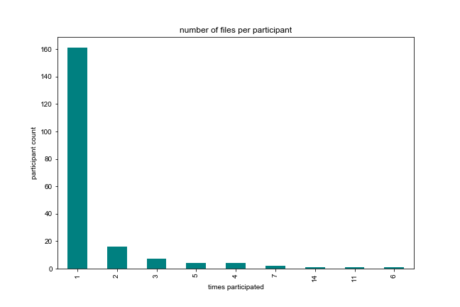
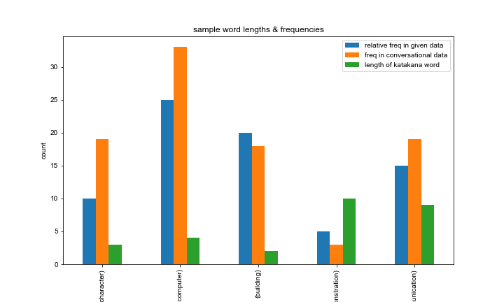
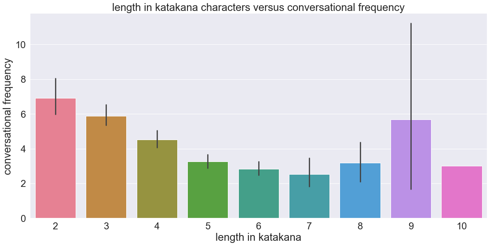
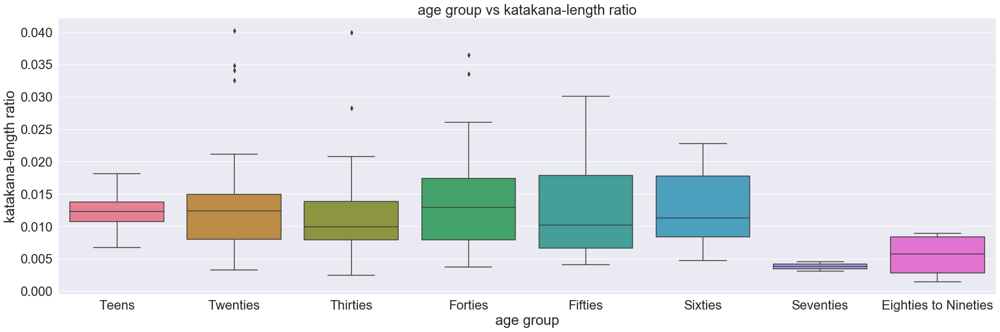
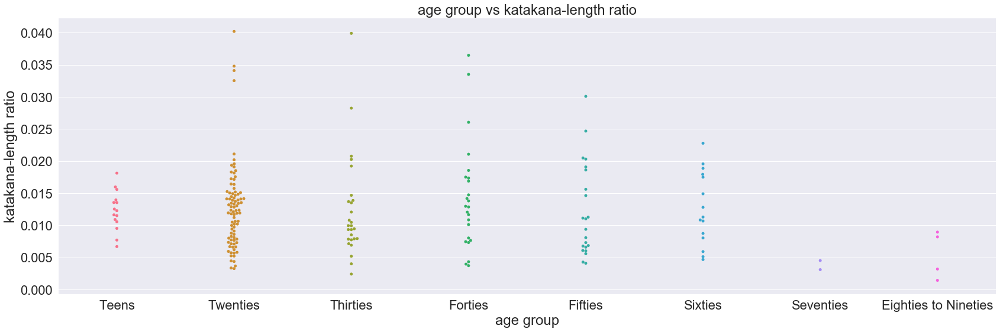
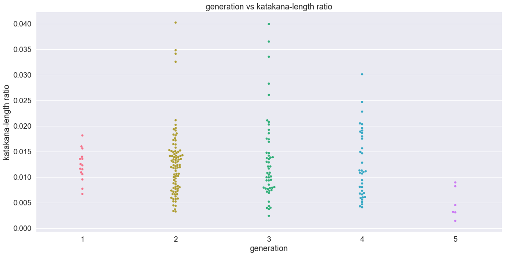
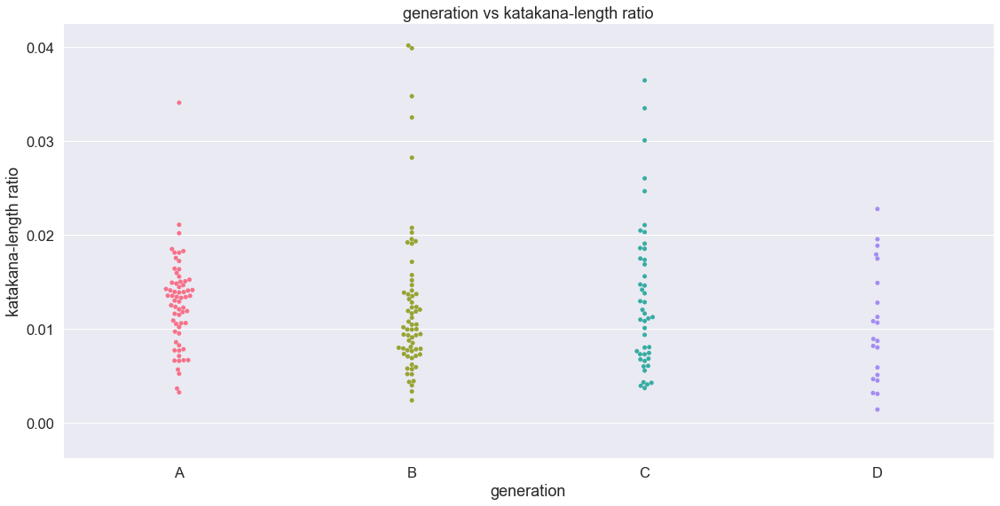

# Final Report
- Lindsey Rojtas
- LING1340
- ler75@pitt.edu    

Welcome to my final report for my term project! Great to have you here. 
## Table of Contents
- [Background and Motivation](#bg)
- [Summary and Hypotheses](#sum)
- [My Corpora](#corpora)
- [The Data Cleaning Process](#data)
- [Analysis](#analysis)
  - [Length vs. Frequency](#lvf)
  - [Age vs. Katakana Use](#avk)
- [Setbacks](#oof)
- [Concluding Remarks](#end)
- [References](#ref)

## Background and Motivation 
To begin, some terminology:
- *Gairaigo*: the Japanese word for "foreign word" or "borrowed word." 
- *Katakana*: One of the three Japanese written scripts (the other two being Hiragana and Kanji). Katakana characters are used to write non-Chinese gairaigo (usually from Western languages), certain names, scientific terminology, and onomatopoeia. 
  - This project focuses more on the non-Chinese gairaigo part of this definition. Compared to Hiragana and Kanji, Katakana is [more rigid](https://difference.guru/difference-between-kanji-hiragana-and-katakana/), which makes it easier to pick out of a string of written Japanese. 
  - Think of this as being the same as how, in English, we italicize foreign words (e.g."getting a sense of *deja vu*")
  
I can understand a small amount of Japanese. I haven't taken any classes at Pitt (or anywhere);the small amount that I know is self-taught. This small amount includes being able to read and interpret Katakana. In the beginning of this whole process, I knew I wanted to do something with Katakana as one of my favorite topics in linguistics is language borrowings. I find it interesting when languages of completely different families borrow from one another, especially with languages like Japanese that have very specific phonetic rules borrowing from something like English (whose phonetic rules are kind of a mess) and adapt that borrowing into something that they can use. Also, during my data gathering process, I was very curious to see whether or not there was a generational change in Katakana use over time. 

## Summary and Hypotheses 
My project takes a look at conversational data and the occurrence of Katakana within them. I would need more than just conversational data, though. There are no written word boundaries in Japanese, so I also used a list of common Katakana words to pick out where exactly certain words were used. With these two datasets combined, I formulated two big questions:
- Is there a correlation between the length of a Katakana word and its frequency within my conversational data?
- Do younger Japanese speakers use gairaigo more often than older speakers?
    
I hypothesized that there *is* a correlation between the length of a Katakana word and its conversational frequency, and that correlation is negative; the shorter the word, the more frequent it will be used. Regarding age, I hypothesized that there would be a weak but still present correlation between age and gairaigo usage; the younger the speaker, the more Katakana will be present in their utterances. 

## My Corpora 
As mentioned, I used two different corpora. My conversational corpus is the [Nagoya University Conversation Corpus](https://mmsrv.ninjal.ac.jp/nucc/). It consists of 129 .txt files that document unstructured conversations from 2001 with anywhere between two and four participants per conversation. Most participants only participated in one conversation, but some participated in more than one. There were 198 documented participants, but one of these participants did not have any utterances documented. Most participants were female, and participants are also divided into age groups that ranged from early teens to early nineties. A sample conversation file can be found [here](https://github.com/Data-Science-for-Linguists-2020/Analysis-of-Japanese-Loanwords/blob/master/samples/convo_sample.txt). Below is a graph of the value counts of the amount of times a participant participated in the corpus conversations; as mentioned, most participants participated once. 

    
My other corpus is derived from the Balanced Corpus of Contemporary Written Japanese. It is not the corpus itself, but rather a [word/frequency list](https://pj.ninjal.ac.jp/corpus_center/bccwj/en/freq-list.html). This original list contained all sorts of Japanese words, not just Katakana, but I reached out to [Reddit user Alphyn](https://www.reddit.com/user/Alphyn), who developed a set of Katakana flashcards based on the BCCWJ list of words. They generously allowed me to use their .csv file that consisted of exclusively Katakana words from this word list. The first 100 words of this list and their data attributes can be found [here](https://github.com/Data-Science-for-Linguists-2020/Analysis-of-Japanese-Loanwords/blob/master/samples/wordlist_samples.csv). 

## The Data Cleaning Process 
The word list was [relatively easy to clean up](https://nbviewer.jupyter.org/github/Data-Science-for-Linguists-2020/Analysis-of-Japanese-Loanwords/blob/master/progress-notebooks/progress_data.ipynb#clean-word). I ended up dropping nearly every column except the Katakana word, its English equivalent, and its web-based frequency. There were some Katakana words that didn't have an English translation, like words for Japanese cities, which were dropped the word from the list. As the list continued, the frequencies of the words dropped, so I dropped words less likely to appear in casual conversation. In dropping all of these words, the list went from 80,000 entries to around 5,000. The idea behind dropping these words was to speed up the process of actually locating the words in the conversational data. 
    
The conversational data was [much more difficult to clean and organize](https://nbviewer.jupyter.org/github/Data-Science-for-Linguists-2020/Analysis-of-Japanese-Loanwords/blob/master/progress-notebooks/progress_data.ipynb#import-conv). I manually created two .csv files (that are hidden in a gitignore'd folder). One organized the conversational data by what file they were in, and another organized the data by which speaker said what. The easy part was getting the data into the file-based dataframe and cleaning up the documentation at the beginning and end of the files, but then I had to split each line by newline characters. Because the .txt files also used newlines as sentence delimiters, I had to attach some speakerless lines to the previous line so they had a speaker. For the sake of ease of finding words, as I [moved these lines into the participant-based dataframe](https://nbviewer.jupyter.org/github/Data-Science-for-Linguists-2020/Analysis-of-Japanese-Loanwords/blob/master/progress-notebooks/progress_data.ipynb#sort-speaker), I kept all of the utterances by a speaker in one big long string, as opposed to an array of lines. As I moved into the analysis phase of my project, I pickled the files (also in a gitignore'd folder) and prepared to delve into my research questions. 

## Analysis 
Before getting to deep into analysis, I addressed some issues like the [double-counting of certain words](https://nbviewer.jupyter.org/github/Data-Science-for-Linguists-2020/Analysis-of-Japanese-Loanwords/blob/master/progress-notebooks/progress_analysis.ipynb#dbl-count), some of which weren't even likely to be used in casual conversation based on what I'd observed. It took a [few attempts](https://nbviewer.jupyter.org/github/Data-Science-for-Linguists-2020/Analysis-of-Japanese-Loanwords/blob/master/progress-notebooks/progress_analysis.ipynb#revisiting-dc), but I did end up with coming up with a fix in the form of [subtracting frequencies of words that appeared within other words](https://nbviewer.jupyter.org/github/Data-Science-for-Linguists-2020/Analysis-of-Japanese-Loanwords/blob/master/progress-notebooks/progress_analysis.ipynb#dbl-fix), which seemed to fix the issue as much as I possibly could. I also dropped any words that weren't used in the conversations, which dropped my word list down to around 2,000 words. 

### Length vs. Frequency 
In order to begin working with length vs. frequency, I got the lengths of the words in both Katakana and English characters. I filtered out anything that might have still been left over from my previous cleaning process, like stop words that skewed other words' frequencies. After this, I took a sample of five words from my word list; three were shortened versions of their English equivalents, two were not. I [plotted their conversational frequencies, as well as their relative frequencies within each other](https://nbviewer.jupyter.org/github/Data-Science-for-Linguists-2020/Analysis-of-Japanese-Loanwords/blob/master/progress-notebooks/progress_analysis.ipynb#vis-lvf) as multiples of five so their web-based frequencies would be easier to look at.   

    
In general, the shorter Katakana-length words were more common, but I wanted to rule out the possibility that this could just be because of conversation topics. To do this, I looked at the translations for "demo" and "demonstration"; as expected, the translation for "demonstration" occurred 3 times in the conversation files while "demo" occurred six times. 
    
The possibility of a negative correlation was there, which is what I was looking for. After going back and fixing that double counting issue I had above, I [plotted](https://nbviewer.jupyter.org/github/Data-Science-for-Linguists-2020/Analysis-of-Japanese-Loanwords/blob/master/progress-notebooks/progress_analysis.ipynb#final-lvf) the length of all the Katakana words versus their conversational frequencies and ran a Spearman's Rho test. I decided to conduct the statistical test because as far as I could see from my bar graph, there seemed to be at least some correlation between length and conversational frequency. I didn't figure it would be strong because of that odd spike towards the write of the graph, but I still wanted to be sure. 
  

  
  
The test gave me -0.25, which [appears to be a very low-end moderate/fair correlation](https://www.sciencedirect.com/science/article/pii/S2452247318302164), or at least a high-end weak correlation. My best guess for why it's so weak is that the longer words modeled to the right of the graph were harder to find a shorter version of when these words were making their way into Japanese language. It's a bit harder to find a shortened version of words like "communication" that are relatively common, so it makes sense that this correlation would be weak. If we looked at words of length 2-7 characters, the correlation would likely be much stronger. I didn't take web frequency into account because I'm more focused on conversational usage. Sometimes, words are way easier to type than they are to say. 

### Age vs. Katakana Use 
This took a bit more data manipulation to analyze. I mentioned previously that there were some participants that participated in many more files than others. I accounted for this issue by taking the ratio of Katakana words used by each participant to the length of their big long string of utterances. Ideally, according to my hypothesis, younger participants would have a higher KLR. However, I had to manipulate my age groups a bit to ensure that the data was as equally distributed as I could get it. To get an idea of how I'd need to sort things, I grouped by decade of age and plotted swarm and box plots:
    

    
Clearly, there are more 20somethings than anything else. I knew I had to work with a different sorting of age groups. I tried to go by generation, which is, [on average, 25 years](https://isogg.org/wiki/How_long_is_a_generation%3F_Science_provides_an_answer). I rounded down to 20 years to make for easy parsing. In the following plot, generation 1 is teens-20s, generation 2 is 30s-40s, and so forth. I also combined anyone over 60 into generation 5 because there are so few participants that are 70 years old and over. This five-generation model was better, but it wasn't where I wanted it to be. 
    

      
I still wasn't happy with this, so I split the generations in a different way:
- Generation A: Early Teens to Early Twenties (64 participants)
- Generation B: Late Twenties to Late Thirties (66 participants)
- Generation C: Early Forties to Late Fifties (46 participants)
- Generation D: Early Sixties to Early Nineties (21 participants)
    
This isn't totally even. I could've made it even by combining generations C and D, but I wasn't comfortable having such a wide age range for one "generation." Still, this is more equal than it was previously:
    
    

The average ratios for each generation are as follows:
- Generation A (Teens-Early Twenties): 0.012766909495889664
- Generation B (Late Twenties-Thirties): 0.012338271480237395
- Generation C (Forties-Fifties): 0.013281978815331375
- Generation D (Sixties-Early Nineties): 0.010426972368483237
    
As such, a Spearman's Rho run gave me a correlation of -0.11, which is incredibly weak, if there is a correlation at all. This makes sense for generations A-C, but there does seem to be a significant drop-off with generation D. As I was thinking about why this could be, I began brainstorming on the history of Japan as a whole. To reiterate a point I made in my notebook:
    
> This conversational data is from 2001, almost two decades ago. The oldest group of people, those in their early nineties, were born around 110 years ago, the 1910s. Japan didn't go through too much thorough Westernization until post-World War II, around the late 1940s-early 1950s, which is closer to when those in generation C were born. This would explain the slight spike and persistent fluctuation of katakana ratios from generations A-C, but a big drop-off in generation D.
    
So, as far as *this* data set goes, it's safe to say that there isn't much of a correlation between age and Katakana use. If there is one, it's incredibly weak. However, I do think that we would get a stronger correlation if I had older data, as generation D has such a larger drop-off compared to other generations. 
    
## Setbacks 
There's a lot I wish I could've done with this project, but just ended up running out of time because of life events or spending a bunch of time fixing bugs. I ran into tons of issues with assigning lines to their speakers I would've liked to use a mixed effects model or some other machine learning stuff here, because I was interested to see how a machine would predict a generation, but I ultimately ran out of time. I would also really liked to have had data that had more of an equal age distribution, maybe some data that was older than the stuff I found, but I'm pretty lucky to have found something easy to work with. Also, this is less of a setback and more of an annoyance, but my nbviewer version of my analysis notebook is out of date. It may fix itself by the time this gets graded, but it's pretty annoying. 
    
## Concluding Remarks
This was a fun project! It was nice to start with something so small in the beginning-ish of the term and build it up to a culmination of what I've learned. I may revisit this project in the future when I gather more experience. My hypotheses were weakly proven at best, but the process of exploring and such is a worthwhile one. 
    
## References
- Differences between Japanese Writing Scripts: https://difference.guru/difference-between-kanji-hiragana-and-katakana/ 
- Nagoya University Conversation Corpus: https://mmsrv.ninjal.ac.jp/nucc/
- BCCWJ Word Lists: https://pj.ninjal.ac.jp/corpus_center/bccwj/en/freq-list.html
- How Long is a Generation?: https://isogg.org/wiki/How_long_is_a_generation%3F_Science_provides_an_answer
